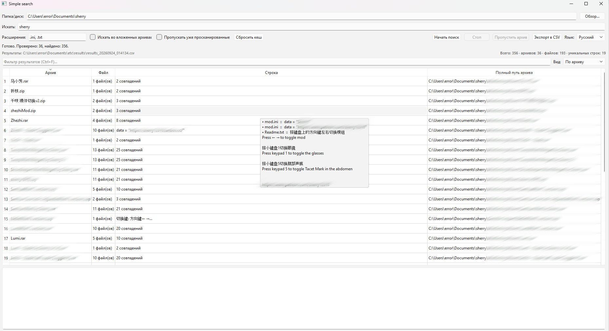

# Simple Search 🔍

GUI-утилита для поиска текста внутри архивов (`zip`, `rar`, `7z`) с поддержкой локализации (RU/EN).


---

## 📖 Описание

**Simple Search** — это десктопное приложение, которое рекурсивно обходит указанную папку или диск, открывает все найденные архивы (`.zip`, `.rar`, `.7z`) и ищет в них файлы с заданным расширением, содержащие искомое слово.

---

## ✨ Возможности

- 🔎 **Поиск по содержимому архивов** — `.zip`, `.rar`, `.7z`
- 📂 **Фильтр по расширению** — ищет слово только в файлах с нужным расширением (по умолчанию `.ini`)
- 🔠 **Учёт регистра** — опциональный режим «Case sensitive»
- 🌍 **Два языка интерфейса** — русский и английский (переключается на лету)
- ⚡ **Многопоточность** — поиск выполняется в отдельном потоке, UI не зависает
- 🛑 **Кнопка «Стоп»** — можно остановить длительный поиск
- 📊 **Прогресс и статус** — счётчик проверенных архивов и найденных совпадений
- 🖱 **Контекстное меню** на результатах:
  - Открыть папку с архивом
  - Открыть сам архив
  - Копировать путь архива / имя файла / найденную строку
  - Копировать всё (`Ctrl+C`)
- 💾 **Сохранение настроек** — путь, слово, расширение, язык, геометрия окна и порядок колонок запоминаются между сессиями (`QSettings`)
- ⚠️ **Предупреждение о UnRAR** — если `UnRAR.exe` не найден, `.rar` архивы будут пропущены (с уведомлением в интерфейсе)

---

## 🖼 Скриншот

> ```markdown
> 
> ```

---

## 🚀 Установка

### 1. Клонирование репозитория

```bash
git clone https://github.com/<ваш-логин>/simple-search.git
cd simple-search
```

### 2. Установка зависимостей
Рекомендуется использовать виртуальное окружение:

```bash
python -m venv venv
# Windows
venv\Scripts\activate
# Linux / macOS
source venv/bin/activate
```
Установите зависимости:
```bash
pip install PySide6 rarfile py7zr
```

### (Опционально) UnRAR для `.rar` архивов

Модуль `rarfile` **не распаковывает** `.rar` самостоятельно — ему нужен внешний `UnRAR.exe`.

- **Windows:** установите [WinRAR](https://www.win-rar.com/) или скачайте `UnRAR.exe` отдельно и добавьте его в `PATH`.
- **Linux:** `sudo apt install unrar` или `sudo dnf install unrar`
- **macOS:** `brew install unrar`

Приложение само попытается найти `UnRAR.exe`:
1. В `PATH`
2. В `C:\Program Files\WinRAR\UnRAR.exe`
3. В `C:\Program Files (x86)\WinRAR\UnRAR.exe`

### 4. Использование

```bash
python simple-search.py
```
